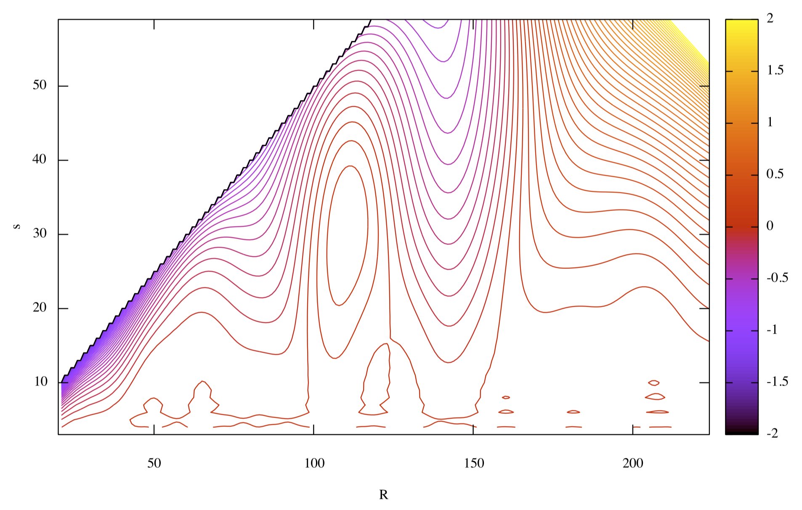

# BAOlets

Fortran scripts to identify Baryonic Acoustic Oscillations (BAOs) in the LOWZ SDSS survey via wavelets (BAOlets), following the paper [arXiv:1101.1911](https://arxiv.org/abs/1101.1911).

It makes use of a set of Large Red Galaxies (LRGs) and standard galaxies extracted from the SDSS-III DR12 catalog through the SQL script `SDSS_query.sql`. These data is stored in `lrg_default.dat` and `main_default.dat` respectively. Data included here is a shorter version of the total files, make use of the SQL script to obtain the full dataset (coordinate transformation may be required).

Compute first the density profile with `profile.f90`, then filter the galaxy survey with wavelets in `baolet.f90`. A gnuplot script to visualize the contours, `contour.p`, is included.

The physics and a previous implementation of the code are discussed in the notes `Baolets.pdf` (in spanish).

